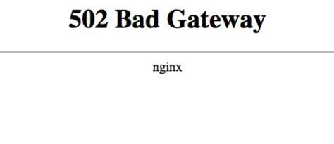

A dark-themed HTTP error page generator.


This is purposefully minimal, it only generates static HTML. It's meant to be a fallback and replace the default blinding `nginx` error pages.



On most of my servers, I'm typically running a reverse proxy with `nginx`, but I don't want to rely on `nginx`-specific syntax, or have to recompile `nginx` with additional modules, in case I want to use these error pages with something else.

To be clear, this is not `nginx` specific, its just why I created this. [Here's me using it](https://github.com/seanbreckenridge/glue/tree/master/lib/glue_web/templates/error) in a completely different web framework; since they're just static HTML files its pretty trivial to add it to any sort of framework/server.

### Install

`go get gitlab.com/seanbreckenridge/darker_errors`

### Usage

This implements a small template language.

It replaces the strings:

* `STATUS_CODE` (e.g. 404)
* `STATUS_MSG` (e.g. Not Found)

With the corresponding HTTP values.

To override the default text for each page, you can use replacement directives:

* `ERROR_TITLE` (Text in `<title>`; default: `STATUS_CODE - STATUS_MSG`
* `ERROR_HEADING` (Large Heading; default: `<h2>STATUS_CODE</h2>`)
* `ERROR_MSG` (Message; default: `<p>STATUS_MSG<p>`)

You can also inject additional HTML by setting one of the following:

* `ERROR_HEAD` (insert HTML into the `<head>` tag, can be used to add additional `<style>` or `<meta>` tags)
* `ERROR_BEFORE_HEADING` (before `ERROR_HEADING`)
* `ERROR_AFTER_HEADING` (after `ERROR_HEADING`, before `ERROR_MSG`)
* `ERROR_AFTER_MSG` (after `ERROR_MSG`)

Options:

```
  -nginx-conf
        generate nginx configuration for mapping static html files
  -output-dir string
        output directory for *.html files (default "error_html")
```

Any additional positional arguments to `darker_errors` are interpreted as replacement directives.

### Examples:

Include website name in `<title>`:

```
darker_errors 'ERROR_TITLE:MyWebsite - STATUS_MSG'
```

If you want to modify the text for just one page, you can specify that by using the HTTP status code

Include text to go back home on a 404:

```
darker_errors '404:ERROR_AFTER_MSG:<p>Click <a href="/">here</a> to go back home.<p>`
```

To left-align text and add a bit of margin: (Modifying the CSS in general would probably require you to take a look at how the elements are positioned in the HTML in [`src/template.go`](./src/template.go)).

```
darker_errors 'ERROR_HEAD:<style>#flexbox { align-items: flex-start } #flexbox > div { margin-left: 10%; }</style>'
```

Add a horizontal rule after the status code:

```
darker_errors 'ERROR_AFTER_HEADING:<hr />' 'ERROR_HEAD:<style> hr { width: 80% }</style>'
```

Refresh the page every 2 seconds if the user encountered a `502` error:

```
darker_errors \
  '502:ERROR_HEAD:<meta http-equiv="refresh" content="2">' \
  '502:ERROR_MSG:<p>This page is currently being updated...<br /> This should be fixed in in a few seconds...</p>'
```

If you specify both `502:ERROR_MSG`, and `ERROR_MSG`, the `502` overwrites the generic replacement for the `502.html` page, while any other page uses the generic `ERROR_MSG` directive.

## nginx setup

Most of the time, I use nginx like:

```
# base elixir server handles everything
  location / {
    include /etc/nginx/pheonix_params;
    proxy_pass http://localhost:8082;
  }
```

.. i.e. every request which doesn't match some other location block gets sent to another 'base' webserver. That means its handles/renders its own HTTP errors, and nginx just forwards that back.

However, whenever that upstream server is down, or restarting, the user just gets the blinding `502 Bad Gateway` page. To avoid that, I typically explicitly mark at least the 502 error code in my `nginx` configuration, with the generated page from here.

To do that, this assumes you've set a `root` in a `server` directive somewhere. That can be `/var/www/html/`, or some other folder.

As an example:

```
server {
  listen [::]:443 ssl ...
  listen 443 ssl ...
  ...
  root /var/www/html;

  # modified from https://stackoverflow.com/a/38414723/9348376

  # base pheonix server which handles most of the requests
  location @pheonix {
    include /etc/nginx/pheonix_params;
    proxy_pass http://localhost:8082;
  }

  # 502 route, incase upstream server is down
  error_page 502 @offline;
  location @offline {
    # file should be at /var/www/html/502.html
    try_files /502.html 502;
  }

  # if the path doesnt match some static file, forward to @pheonix server
  location / {
    try_files $uri @pheonix;
  }
}
```

In the case above, since `root` is `/var/www/html`, put the generated `502.html` file at `/var/www/html/502.html`.

If you want to use this directly with `nginx`, you could put the `error_html` folder in `/var/www/html`, and then map each error code to the HTML page, like:

```
server {
  ...
  error_page 401 /error_html/401.html;
  error_page 404 /error_html/404.html;
  error_page 502 /error_html/502.html;
}
```

To generate the configuration for that, you can run:

```
darker_errors -nginx-conf
```

[`nginx` `error_page` documentation](https://nginx.org/en/docs/http/ngx_http_core_module.html#error_page)
